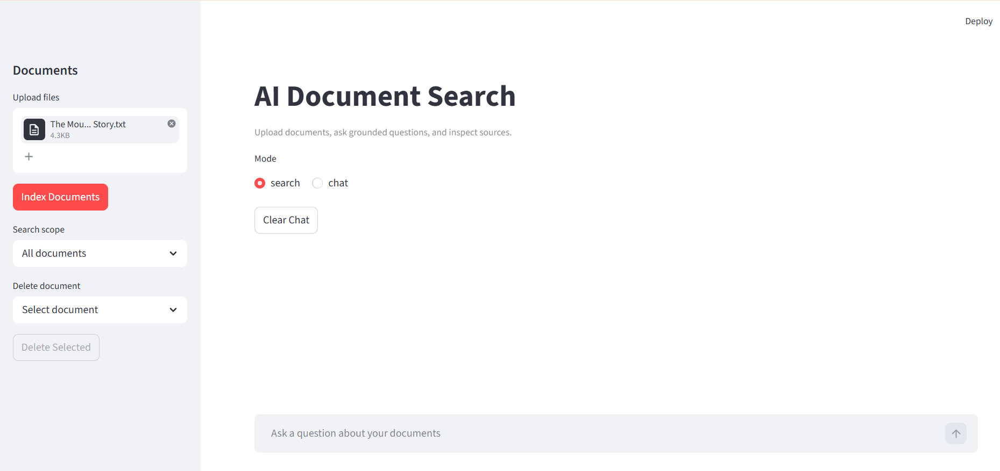
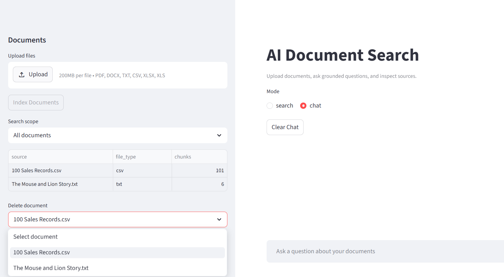
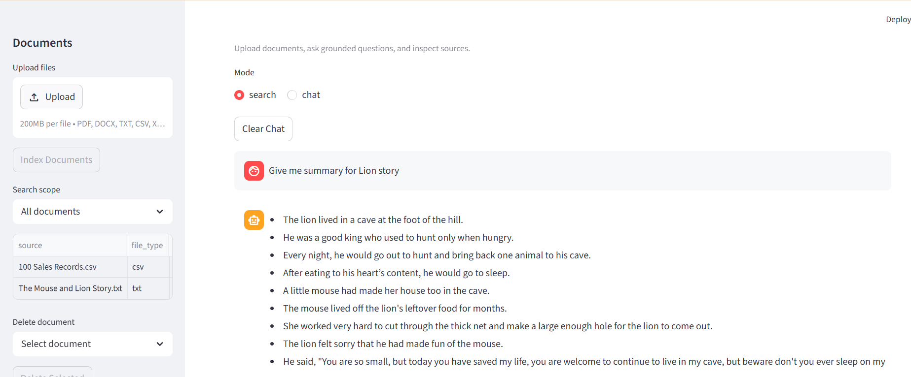

# 🚀 AI Document Search (RAG)

Ask questions on your documents like ChatGPT — with **source citations, multi-format support, and local AI models**.

👉 Upload PDFs, DOCX, Excel, CSV, TXT  
👉 Ask questions  
👉 Get answers with exact sources (page, row, chunk)

---

## 🎥 Demo

### 📄 Upload Documents


### 📚 Document Management


### 💬 Ask Questions + Sources


---

## 🔥 Key Features

- 🧠 Chat Memory (multi-turn conversation)
- 🔍 Hybrid Search (vector + keyword reranking)
- 📄 Multi-format ingestion (PDF, DOCX, CSV, Excel, TXT)
- 📚 Source-based answers with filename, page, sheet, row, chunk, and preview
- 📊 Table understanding (CSV / Excel with row-level indexing and numeric summaries)
- ⚡ Local LLM via LM Studio (OpenAI-compatible, zero API cost)
- 🗂 Multi-document search + filtering
- ❌ Document deletion with FAISS re-indexing
- 🐳 Dockerized backend and UI

---

## 🏗️ Architecture

```
Streamlit UI
    ↓
FastAPI Backend
    ↓
Document Extraction (PDF, DOCX, CSV, Excel)
    ↓
Chunking + Metadata
    ↓
HuggingFace Embeddings
    ↓
FAISS Vector Store
    ↓
Hybrid Retrieval + Reranking
    ↓
LM Studio (Local LLM - OpenAI Compatible API)
    ↓
Answer + Source Citations
```

---

## 🛠 Tech Stack

- FastAPI
- LangChain
- FAISS
- HuggingFace sentence-transformers
- LM Studio (OpenAI-compatible API)
- Streamlit
- pandas / openpyxl
- python-docx / pypdf
- Docker

---

## ⚙️ Setup

### 1. Create virtual environment

```
python -m venv venv
venv\Scripts\activate
```

### 2. Install dependencies

```
pip install -r requirements.txt
```

### 3. Configure environment

Create a `.env` file:

```
LM_STUDIO_BASE_URL=http://127.0.0.1:1234/v1
LM_STUDIO_MODEL=qwen2.5-coder-1.5b-instruct
LM_STUDIO_API_KEY=not-needed
CHUNK_SIZE=1000
CHUNK_OVERLAP=180
RETRIEVER_K=6
RERANK_CANDIDATES=12
HF_HUB_OFFLINE=0
API_BASE_URL=http://127.0.0.1:8000
```

### 4. Start LM Studio

Ensure server running at:
http://127.0.0.1:1234

### 5. Start backend

```
uvicorn app.main:app --reload
```

### 6. Start UI

```
streamlit run streamlit_app.py
```

### 7. Open

UI: http://127.0.0.1:8501  
API: http://127.0.0.1:8000/docs  

---

## 🐳 Docker

```
docker compose up --build
```

---

## 📡 API Endpoints

GET /health  
POST /upload  
POST /upload/multiple  
GET /ask  
POST /chat  
GET /documents  
DELETE /documents  

---

## 📁 Project Structure

```
app/
  main.py
  routes.py
  rag.py
  utils.py

streamlit_app.py

data/
vectorstore/
assets/
docs/
```

---

## 🧠 Resume Summary

Built an AI-powered document search system (RAG) with Streamlit UI and FastAPI backend, supporting multi-format ingestion and hybrid retrieval using FAISS with local LLM inference via LM Studio.

---
